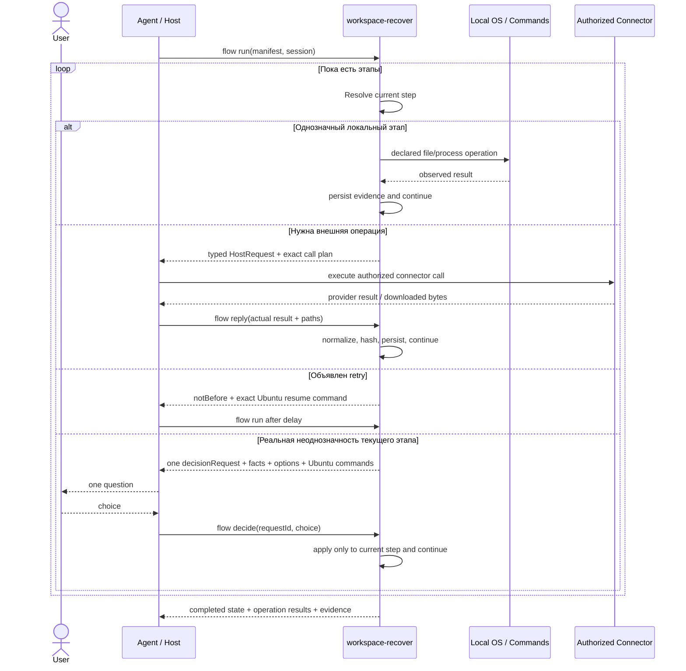

# workspace-recover

Самостоятельный инструмент с одной продуктовой целью: **подготовить пакет восстановления и успешно применить его**.
Он автоматизирует механическую работу агента: вычисляет точные входы, операции, host-запросы, хэши, решения текущего этапа и следующие действия. Агент не должен помнить внутренний протокол или вручную собирать служебные письма/ссылки.

Папка переносится целиком: runtime-imports из родительского репозитория и соседних
приложений отсутствуют. Это развиваемая поставка; версия находится в package.json, границы проверки — ниже.
В финальной поставке локальная `.git/` фиксирует версии самостоятельного пакета;
это не история родительского monorepo. GitHub-адреса в package metadata задают
целевые реквизиты продукта; публикация
репозитория этой поставкой не выполняется.

Для агента: [skill работы с инструментом](skills/workspace-recover/SKILL.md).

## Запуск без установки зависимостей

Требуется Node.js 20 или новее. Проверено в Linux x86_64 с Node.js 22.16.0;
другие ОС и версии не объявлены проверенными. Все runtime-модули — Node built-ins.
PHP, Composer, Docker и Stoneweave самому инструменту не нужны. Требования команд
конкретного manifest обеспечивает оператор резервируемой системы.

```bash
node /path/to/workspace-recover/bin/workspace-recover.mjs --help
node /path/to/workspace-recover/scripts/check.mjs
```

`npm test` из каталога приложения запускает тот же собственный runner; `npm install`
не нужен. В примерах ниже `workspace-recover` обозначает bin-команду пакета; без
установки заменяйте её на `node /path/to/workspace-recover/bin/workspace-recover.mjs`.

## Распространение через npm

SemVer пакета — публичный контракт. `1.0.0` означает зафиксированный основной workflow; совместимые исправления идут в patch, совместимые функции — в minor, несовместимые изменения — только в major.

Проверка поставляемого tarball выполняется до релиза:

```bash
npm pack
npm install -g ./workspace-recover-1.0.0.tgz
workspace-recover --version
workspace-recover flow template --output /tmp/recovery.json
```

После публикации в registry установка должна сводиться к `npm install -g workspace-recover@1`. Публикация считается состоявшейся только после фактического ответа npm registry; наличие tarball или тега Git публикацией не является.

## Основной вход 1.0.0: поток по манифесту

Для новых сценариев используется `flow`. Ответ пользователя относится только к
текущему шагу; после него остальные однозначные шаги выполняются без вопросов.
Рабочая и сборочная папки могут не существовать; временный путь можно не задавать.
Проектные автотесты исполняются только как обычные команды авторского манифеста.

```bash
workspace-recover flow template --output /tmp/recovery.json
workspace-recover flow run --manifest /tmp/recovery.json --session /tmp/recovery-session
```

[Документация потока](docs/flow.md) содержит параметры, решения, Ubuntu-команды и
границу host/инструмент. [Developer skill](skills/workspace-recover-development/SKILL.md)
закрепляет контракт разработки. Штатный шаблон содержит пустой список шагов и
только неисполняемый комментарий с рекомендацией автотестов.

### Итоговый рабочий процесс



Этапы:

1. **Manifest.** Автор заранее задаёт желаемую последовательность. Инструмент не добавляет свои тесты, deployment gates или cleanup.
2. **Resolve current step.** Пути и входы проверяются только тогда, когда нужны текущей операции; будущая временная папка не считается отсутствующим пользовательским вводом.
3. **Local execution.** Файловые операции, hashing и команды исполняются ровно как объявлено; наблюдаемый результат сохраняется независимо от дальнейшего решения пользователя.
4. **Host boundary.** Если нужен Drive/Gmail, инструмент формирует точный HostRequest. Агент лишь вызывает уже выбранный connector с готовыми параметрами и возвращает фактический ответ.
5. **Retry.** Объявленная политика retry не создаёт вопрос человеку: tool возвращает момент следующего запуска и готовую Ubuntu-команду.
6. **Decision.** Человек вовлекается только при реальной неоднозначности текущего этапа. Ответ действует только на него; глобального «применить ко всем» нет.
7. **Continue.** После host/retry/decision инструмент автоматически исполняет весь оставшийся однозначный хвост manifest.
8. **Evidence.** Состояния, outputs, hashes, stdout/stderr, host responses и решения остаются в session evidence; повторный `run` не повторяет завершённые шаги.

Цель интерфейса — минимизировать рассуждение агента: нормальный агентский цикл сводится к `run -> выполнить готовый host-plan/decision -> reply/decide -> run`.

## Совместимость: прежние backup/restore v3

Следующие разделы описывают явно выбранные прежние команды и их фиксированный
договор доставки, сохранённый для обратной совместимости. Он не применяется к
`flow` и не является обязательной последовательностью для новых сценариев.

## Пакетные входы без предварительного вызова

Готовые формы лежат в поставке: `templates/local-project/values.example.json`
и `templates/google-workspace-project/values.example.json`. Скопируйте нужный
файл, заполните все `null` одним пакетом и передайте `--values FILE`.
`template describe NAME --format json` остаётся доступен, но не обязателен.

Форматы этого выпуска — только `workspace-recover/<kind>/v3`.
Документы без версии, `/v1`, `/v2` и неизвестные версии отвергаются, не преобразуются.

```bash
workspace-recover backup local-project --values project.values.json --non-interactive
workspace-recover backup local-project --values shared.json --values machine.local.json --set partSizeBytes=1048576
workspace-recover backup local-project --interactive --editor /usr/bin/nano
```

`--values` повторяется; более поздний слой перекрывает ранний, объекты объединяются,
массивы заменяются. `--set key=value` и `--set-json key=JSON` перекрывают файлы.
Происхождение и история значений записываются в plan. Машинные пути и credentials
не входят в versioned проектную конфигурацию. CLI-аргументы видны ОС; секреты в них
не передаются.

Все отсутствующие и неверные значения выдаются одним пакетом, рядом сохраняются
`missing-values.json` и `input-requirements.json`. Заполните файл и выполните
один `continue SESSION --values FILE`. `--interactive` открывает весь файл одним
вызовом executable `EDITOR`/`VISUAL` либо `--editor PATH` без shell и одиночных вопросов.

## Однократная подготовка и обычная работа

```bash
cd /work/my-project
workspace-recover init local --set backupRoot=/backups/my-project --non-interactive
workspace-recover backup
workspace-recover info
```

Для Google: `init google-workspace --values setup.json`. Шаблон копируется в
`.workspace-recover/template.json`; декларация находится в
`.workspace-recover/project.json`. Изменяемые машинные значения записываются в
`.workspace-recover/values.local.json`, для которого сразу создан локальный
`.gitignore`. Если source не задан отдельно, он вычисляется от корня проекта и
остаётся корректным после перемещения каталога. `init` не перезаписывает существующую
конфигурацию. Вызов из подкаталога использует ближайшую проектную декларацию.

`info`, `next` и `continue` без ID используют текущую сессию именно данного
проекта/каталога, а не последнюю сессию другого проекта. Явный ID доступен всегда.
`info` по умолчанию показывает `medium`; `--short`/`--full` выбирают другие виды.
Полный вид по-прежнему печатает только путь.

Экспертный интерфейс `backup TEMPLATE --values FILE` сохранён. Подготовку Google
OAuth описывает [инструкция оператору](docs/google-workspace-oauth.md).

Каждый backup создаёт отдельные части, скачивает их обратно, проверяет содержимое
и выполняет восстановление по созданному recovery manifest в своей новой папке
ОС. Затем выполняет объявленный workflow и формирует handoff с внешним recovery
manifest. Манифест автоматически в payload не добавляется. Это обратимая копия
содержимого source, включая `.git/`, если он не исключён автором.

```bash
workspace-recover restore --handoff /backups/example/handoffs/SESSION --target /work/restored
workspace-recover restore GMAIL_MESSAGE_URL --target /work/restored
workspace-recover restore --manifest edited-recovery.json --target /work/restored-edited
```

Передача `--manifest` означает осознанный запуск выбранного оператором manifest.
Он копируется в новую сессию. Старые планы, манифесты и handoff не изменяются.
Тесты и cleanup исполняются в объявленном порядке, без выбора за автора.

## Один указатель для восстановления

```bash
workspace-recover profile create personal --values profile-values.json
workspace-recover restore GMAIL_MESSAGE_URL --profile personal
workspace-recover info
```

Форма локального профиля поставляется в `templates/profile.values.example.json`.
Профиль хранит локальный workspaceRoot и имя Google credential profile. Указатель
восстановления может быть Gmail-ссылкой, local handoff или recovery JSON-файлом.
При наличии профиля каталог назначения вычисляется из project.name в manifest.
Подробности: [локальные профили](docs/local-profiles.md). Выбор workflow остаётся
за автором manifest.

## Сессия и доказательства

Итог сообщает `Session`, состояния операции и одну строку `More`. Для ожидания
входных данных или Google auth он сообщает конкретное следующее действие.

```bash
workspace-recover next SESSION
workspace-recover continue SESSION --set target=/work/restored
workspace-recover info SESSION
workspace-recover info SESSION --type verification --view medium
workspace-recover info SESSION --type restore --view full
```

`short` — сводка; `medium` — полезные подробности конкретного типа результата;
`full` всегда выводит **только путь** к первичной записи. Без `--type` полное
представление указывает на `session.json`. Чтение `info` не запускает команды.

## Границы поставки

Локальные backup → handoff → restore и clean-room проверки покрыты контрактами.
Прямой OAuth provider и PKCE callback проверены протокольными fixtures, но end-to-end с реальным Google account в этой
поставке не проверен; облачные передачи артефактов разработки выполнены отдельным
авторизованным connector. Наличие файлов OAuth не является проверкой доступа.

`continue` поддерживает ожидание ввода/auth и frozen plan; автоматическое
восстановление после произвольного убийства процесса посреди команды с внешними
эффектами пока не гарантируется. В таком случае сначала изучается сохранённая
сессия, а повторное выполнение не объявляется exactly-once.

Нативный формат — JSON manifests и TAR.GZ payload. Старые ERP cumulative TAR.XZ
checkpoint не распознаются как новый формат автоматически. Чистая папка ОС
проверяет отсутствие файловой зависимости от исходного checkout, но не является
container/VM sandbox. Команды manifest исполняются с правами оператора.

## Комплект

[Workflow](docs/backup-and-recovery.md) ·
[Шаблоны и manifests](docs/templates-and-manifests.md) ·
[Отчёты](docs/reporting-and-sessions.md) ·
[OAuth](docs/google-workspace-oauth.md) ·
[Безопасность](docs/security.md) ·
[Диагностика](docs/troubleshooting.md) ·
[Skill агента](skills/workspace-recover/SKILL.md) ·
[Итоговый аудит плана](docs/implementation-plan.md) ·
[Версии и выпуск](docs/release-policy.md) ·
[Контракт tooling](docs/declarative-tooling-contract.md)


## Исправление архивов и границ восстановления — 0.2.4

Исправлены WR-028-01 (длинные пути) и WR-028-02 (выход через существующие
ссылки при `merge`). См. [отчёт об исправлении](docs/archive-boundary-fix.md).
Новый архив использует POSIX PAX, когда имя/цель ссылки не помещается в ustar;
имена не обрезаются. `merge` сохраняет обычное слияние, но не следует существующим
ссылкам. Операция требует исключительного доступа к target и его предкам.
Проверены Linux x86_64, Node.js 22.16.0 и GNU tar 1.35. Полная ERP этим выпуском
не восстанавливалась: проверен точный относительный путь из отчёта с тестовыми
байтами и расширенный файловый набор.

Чистая комната создаётся в `os.tmpdir()` через `mkdtemp`; в проверенной среде это
`/tmp`. Явный `TMPDIR` выбирает другую системную временную папку на Linux.
Успешная комната удаляется, предупреждение/сбой оставляет её для расследования.
Это временный каталог, не контейнер и не sandbox.

## Работа через интеграции агента

[Исполнитель connector](docs/connector-execution.md) позволяет агенту обслуживать
Drive/Gmail без передачи OAuth-реквизитов в CLI. Формы уже входят в поставку:
`templates/connector/capabilities.example.json`,
`templates/connector/results.example.json` и
`templates/google-workspace-connector/values.example.json`.

Самостоятельный Node-процесс не получает доступ к инструментам среды автоматически.
В этой схеме агент обслуживает запросы работающего процесса; оператор не переносит
ссылки вручную. В программируемом host используется dispatchCommand.

Выбор содержимого: [include/exclude и inventory](docs/selection.md).

## Свои команды упаковки и распаковки

[Парный контракт](docs/archive-profiles.md) позволяет автору манифеста задать **собственные** `pack` и `unpack` команды как `argv`. Инструмент не выбирает формат за пользователя, не содержит каталога команд для 7z/xz/zip и не устанавливает архиваторы. Без внешнего профиля используется штатный TAR.GZ/PAX. Для любого другого формата обе команды задаёт пользователь; инструмент связывает аргументы, сохраняет их в recovery manifest и проверяет восстановленный inventory.

## 1.0.0: caller-owned recovery flows

[Flow operator documentation](docs/flow.md) describes the generic `flow` entrypoint.
[Development skill](skills/workspace-recover-development/SKILL.md) defines stage-scoped
decisions, silent deterministic continuation, deferred folders, and resilient delivery.
Run `node bin/workspace-recover.mjs flow template` for the empty stock template.
