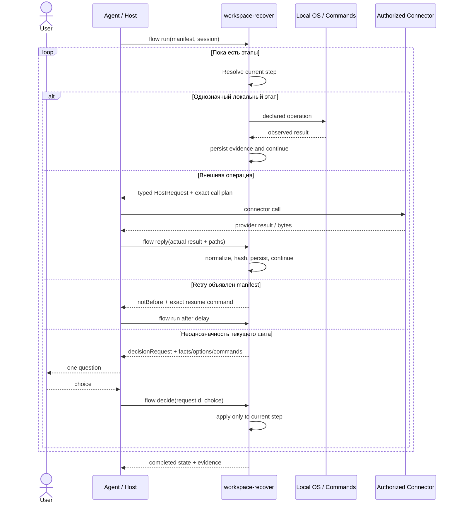

# Поток восстановления: решения только для текущего шага

Цель продукта — подготовить пакет восстановления и успешно применить его с минимальным количеством работы и знаний со стороны агента. Tool должен выдавать достаточно точные результаты и следующие действия, чтобы агент механически исполнял внешние операции, а человек подключался только к реальной неоднозначности текущего шага.

## Контракт

Инструмент сообщает наблюдения и исполняет манифест. Решение пользователя по
возникшему вопросу относится **только к текущему шагу**. Оно не становится
настройкой всех следующих шагов. После этого шага исполнитель возвращается к
неизменённому манифесту. Пока на следующих шагах всё однозначно, задавать
пользователю вопросы, просить подтверждение продолжения, выбора уже заданных
файлов или отправки уже объявленного письма **запрещено**.

`WAITING_HOST`, `WAITING_RETRY`, `PAUSED` и `BUSY` — технические состояния,
не запрос разрешения пользователя. Агент обслуживает их самостоятельно.
`WAITING_DECISION` содержит единственный `decisionRequest` текущего шага.
Повторный status/run возвращает тот же ID. После показа агент вызывает `flow presented --session DIR --request ID`: `questionNeeded` становится false и сохраняется между вызовами; уже заданный вопрос не повторяется.
Новый запрос допустим только при новой фактической неоднозначности.

Обязательной приёмки приложения нет. Проектный тест — обычная `command` или
`verification`, добавленная автором конкретного манифеста. В штатном шаблоне
нет команд тестов, репортёров, количества ожидаемых тестов или готовности
приложения. Там только неисполняемый комментарий с рекомендацией автотестов.
Код операции, наблюдение и решение вызывающей стороны — разные данные.

## Каноническая последовательность



### Что делает каждый этап

1. **Manifest:** пользователь/автор описывает желаемые операции; tool не дописывает скрытую политику.
2. **Resolve:** tool разрешает только данные текущего шага. Будущие inputs и временные каталоги не запрашиваются заранее.
3. **Local operation:** операция выполняется, её фактический результат сохраняется. Failure остаётся наблюдением и не превращается в глобальный запрет.
4. **Host operation:** tool формирует HostRequest с точными файлами, recipient/subject, Drive ID/folder, hashes и ожидаемой формой ответа. Агент только вызывает авторизованный connector.
5. **Retry:** tool сам определяет объявленную задержку и возвращает точную Ubuntu-команду следующего запуска; вопрос пользователю запрещён.
6. **Decision:** только реальная неоднозначность текущего шага порождает один decisionRequest. Решение не переносится на следующие шаги.
7. **Continuation:** после ответа выполняется весь однозначный остаток.
8. **Evidence:** session хранит immutable/frozen входы, outputs, logs, hashes, host exchanges и решения для продолжения без повторной работы агента.

## Запуск

```bash
node bin/workspace-recover.mjs flow template --output /tmp/recovery.json
node bin/workspace-recover.mjs flow run \
  --manifest /tmp/recovery.json --session /tmp/recovery-session
node bin/workspace-recover.mjs flow status --session /tmp/recovery-session
```

`workspace` можно не указывать: создаётся временный каталог. Указанный, но ещё
не существующий каталог создаётся. `--limit 1` ограничивает число законченных
операций за вызов; затем повторяется `flow run --session ...` без подтверждений.
По умолчанию выполняется весь однозначный остаток манифеста.
Состояние сессии хранится отдельно от рабочей области. Завершённые операции
не повторяются при повторном run. Произвольное прерывание внутри операции
не означает, что эффект отсутствует: инструмент предъявляет текущий шаг,
а пользователь может продолжить, повторить, заменить или пропустить его.

## Временная папка с артефактами

Папка в шаблоне — описание будущего пути, а не требование существования.
Проверка наличия источника выполняется **в момент потребления**: предыдущий
шаг может создавать этот источник. `tempdir` без `path` вызывает аналог
`mktemp -d`; результат можно получить через `saveAs`. Сборочная папка не
удаляется автоматически, чтобы результат не исчез раньше резервирования.

```json
{
  "schema": "workspace-recover/flow/v3",
  "steps": [
    {"id": "stage", "op": "tempdir", "saveAs": "artifacts"},
    {"id": "metadata", "op": "write", "to": "${variables.artifacts}/note.txt", "content": "Recovered files"},
    {"id": "pack", "op": "archive", "from": "${variables.artifacts}", "to": "result.tar.gz"}
  ]
}
```

Эквивалентные Ubuntu-команды для понимания операций:

```bash
stage="$(mktemp -d -t wr-artifacts-XXXXXX)"
mkdir -p -- "$stage"
printf '%s\n' 'Recovered files' > "$stage/note.txt"
tar -czf /tmp/result.tar.gz -C "$stage" .
sha256sum -- /tmp/result.tar.gz
```

Это примеры, не скрытые действия исполнителя. Он использует собственный
TAR.GZ-код, а не подменяет команды манифеста этими примерами.

## Операции и решения

| Операция | Основные поля | Поведение |
|---|---|---|
| `tempdir` | `path?`, `parent?`, `prefix?`, `saveAs?` | Создать объявленную или автоматически выбранную временную папку. |
| `mkdir` | `path` | Создать каталог с родителями; существующий каталог не вызывает вопроса. |
| `input` | `path` либо `search`/`names`; `expected?`; `remote?` | Найти файл в момент выполнения. Однозначный хэш выбирает байты; известный remote вызывает host, не пользователя. |
| `copy` / `move` | `from`, `to`, `existingTarget?` | Разместить содержимое; принятое решение затрагивает только эту операцию. |
| `archive` | `from`, `to`, `include?`, `exclude?` | Упаковать каталог; для намеренно пустого источника есть `missingSource: create-empty`. |
| `extract` | `from`, `to`, `existingTarget?` | Распаковать TAR.GZ; остальные форматы доступны явной командой манифеста. |
| `write` | `to`, `content`, `existingTarget?` | Записать строку или JSON. |
| `hash` | `path`, `expected?` | Зафиксировать размер и SHA256; несовпадение не запрещает последующие операции. |
| `command` / `verification` | `argv`, `cwd?`, `env?`, `timeoutMs?`, `onError?`, `retry?` | Выполнить ровно объявленную команду и сохранить stdout/stderr/exitCode. |
| `host` | `operation`, `payload` | Выполнить типизированную операцию через авторизованный адаптер. |

При существующем назначении `existingTarget: merge/overwrite/new-directory/skip`
исполняется без дополнительных вопросов. Если выбор не задан, возникает
один вопрос текущего этапа. `overwrite` каталогов сохраняет предыдущую
версию рядом под именем `.previous-<id>`; `merge` сохраняет посторонние файлы,
а заменённые листья — под таким же суффиксом. Путь нового каталога возвращается
в результате этого шага; будущие пути не переписываются. Связь между шагами
задаётся явно через `outputs.<step>.path` или `variables.<saveAs>`.

```bash
node bin/workspace-recover.mjs flow decide \
  --session /tmp/recovery-session \
  --request 'decision_ID_ИЗ_ОТЧЁТА' --choice merge
```

Реальный JSON содержит готовую команду с реальным ID. Для замены источника:

```bash
node bin/workspace-recover.mjs flow decide \
  --session /tmp/recovery-session \
  --request 'decision_ID_ИЗ_ОТЧЁТА' --choice use-source \
  --params '{"path":"/mnt/data/exact-source.tar.gz"}'
```

После decide автоматически выполняется однозначный остаток. Нет команды
«применить ко всем», скрытого переноса ответа или обязательного объяснения
пользовательского выбора. `replace-step` принимает JSON только текущего шага;
исходный манифест и журнал решений сохраняются.

## Ошибки, повторы, границы фактов

По умолчанию неуспех команды сохраняется как `failed`, следующий независимый
шаг выполняется. Автор может явно задать `onError: ask` или `onError: stop`.
Это его политика, а не требование инструмента. Указанный timeout относится
только к этой команде. Автотесты инструмента — процесс разработки, не этапы,
принудительно добавляемые к восстановлению пользователя.

Повторы задаются на операции:

```json
{"retry":{"maxAttempts":3,"delayMs":60000}}
```

Исполнитель сохраняет `notBefore` и готовую команду `sleep ...; ... flow run`.
Повторяется только текущая операция; пользователь не спрашивается. Автоповтор
изменяющих внешних вызовов разрешается только объявлением автора; неизвестный
исход upload/send сначала сопоставляется с фактическими remote-результатами.
Отсутствие ответа не доказывает, что письмо не отправлено. Выбор `retry`
для неизвестного исхода остаётся доступен вызывающей стороне и записывается.

Несовпадение хэша не превращается в совпадение после разрешения продолжить.
`reported-completed` означает сообщение вызывающей стороны, не измеренный
успех. Инструмент не заявляет готовность приложения. Структурно нечитаемый
JSON, отсутствующая программа или ошибка файловой системы описываются
как техническая невозможность конкретной операции. Доверенная `command`
позволяет объявить альтернативный способ; встроенный распаковщик не делает
скрытых записей за пределами выбранного назначения.

## Роли Drive/Gmail

Подготовка запроса, путей, имён, адресата и тела письма — инструмент по манифесту.
Вызов коннектора и получение его результата — агент/host. Хэширование и фиксация
ответа — инструмент. Человек не переносит ссылки и не составляет служебные
письма, если эти значения уже определены. Локальный процесс не получает
токены аккаунтов и не притворяется владельцем endpoint коннекторов.

```bash
node bin/workspace-recover.mjs flow host-plan --session /tmp/recovery-session
node bin/workspace-recover.mjs flow host-claim --session /tmp/recovery-session
node bin/workspace-recover.mjs flow reply --session /tmp/recovery-session \
  --result /tmp/raw-connector-result.json --path /mnt/data/downloaded-file
node bin/workspace-recover.mjs flow run --session /tmp/recovery-session
```

`host-claim` сохраняет начало внешнего вызова. При следующем обращении незавершённая запись upload/send порождает поиск для сверки фактического результата, а не повторную отправку. Для read допустим повтор без вопроса. Исходящие файлы копируются в отдельные снимки сессии; изменение исходной папки не меняет уже подготовленный запрос.

`--path` нужен для скачанного файла и должен совпадать с фактически
материализованным путём. `reply` оборачивает сырой результат в привязанный
HostResponse, вычисляет наблюдаемые хэши; агент не составляет квитанцию вручную.
Для вложений Gmail `--attachments paths.json` принимает массив `[{"name":"receipt.json","path":"/фактически/скачанный/файл"}]` и вычисляет локальные хэши. Сначала читается родительское письмо, затем используются
его точные attachment ID. Действия bridge не являются вопросами человеку.

## Совместимость

Добавлен `flow`, native-команды backup/restore v3 сохранены для чтения и
исполнения прежних архивов и договоров доставки. Они не являются штатным
шаблоном нового потока: их прежний фиксированный цикл проверки доставки
не навязывается `flow`. Номер формата v3 и версия релиза 1.0.0 различны.
CD-кандидаты 038–040 и их проектная политика не импортируются новым ядром.
Профили приложений поставляются отдельно; специальная логика профиля не
попадает в стандартный шаблон или developer skill.

Коды CLI: 0 — последовательность завершена (результаты отдельных операций остаются в JSON); 10 — текущее решение; 11 — host; 12 — срок повтора; 13 — активный исполнитель; 14 — лимит шагов; 15 — остановка автора. Код 1 обозначает ошибку самого вызова/формата. Нулевой код не является решением о качестве приложения.
